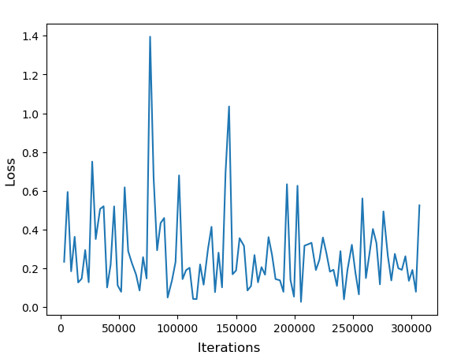

# Zero Shot Image Segmentation using OpenAI's CLIP 

Code to perform Zero Shot Segmentation using CLIP's Encoder and U-Net Decoder based on text-prompts trained on PhraseCutDataset

# Instructions to Run

1) Clone [PhraseCut Dataset](https://github.com/ChenyunWu/PhraseCutDataset)
2) Download dataset with images using `python download_dataset.py` in PhraseCut Directory
3) Run [Generator](generator.py) to split data
4) Run [Zero_Shot_Segmentation_Clip](Zero_Shot_Segmentation_Clip.ipynb)

# Working

- Model accepts a text prompt and an image as input
- CLIP is used to create an embedding of the text prompt and the input image
- U-Net decoder is trained on PhraseCut Dataset to produce a binary segmentation map

# ClipSeg

A Basic code to perform segmentation using ClipSeg can be found [here](https://colab.research.google.com/drive/1ukoGrDXUh5DhwwWySeAxkQB3UwrPPWn-?usp=sharing)

# Results

